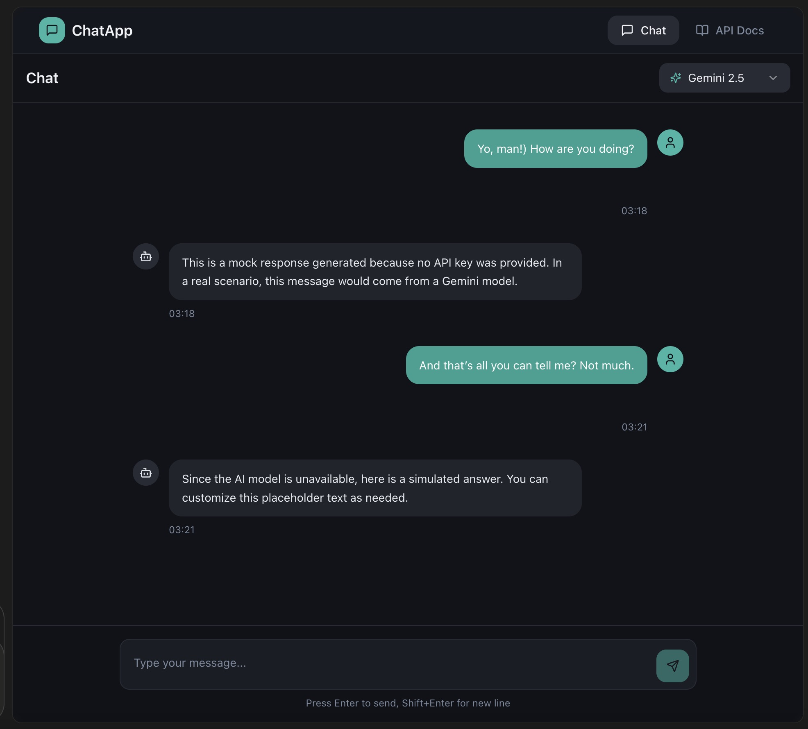

# Mini ChatGPT-Style App Using Python, AI Tools & Gemini

This is a **test project** designed as a home assignment to demonstrate backend development skills, AI integration, and frontend interaction. The project showcases a simple "chat with an AI" application using Python, Flask, and Google Gemini models, with a minimal Lovable frontend.

---



## Table of Contents

- [Summary](#summary)
- [Project Objective](#project-objective)
- [Tools & Requirements](#tools--requirements)
- [REST API](#rest-api)
- [Frontend](#frontend)
- [AI-Generated Documentation](#ai-generated-documentation)
- [Running the Project](#running-the-project)
- [AI Usage Notes](#ai-usage-notes)
- [Bonus Feature](#bonus-feature)

---

## Summary

This project demonstrates a mini ChatGPT-style application with Python, Flask, Google Gemini integration, and a Lovable frontend.
It is a test project for educational purposes, showcasing AI-assisted development, backend-frontend integration, and REST API design.

### Lovable frontend link
https://lovable.dev/projects/2f973fd8-a86a-4883-9ea4-4fbfbe303fd3

## Project Objective

The goal of this project is to:

- Learn a new backend stack (Python + Flask)
- Use AI coding assistants (PyCharm OpenAI/ProxyAI plugin or JetBrains AI Assistant)
- Integrate with Google Gemini (support for Gemini 2.5 and Gemini 3)
- Build a small UI using Lovable
- Generate REST API documentation with AI assistance
- Deliver a working end-to-end chat flow

> Note: This is **not production-grade code**. The focus is on structure, clarity, and AI-assisted development.

---

## Tools & Requirements

**Backend:**

- Python 3.x + Flask
- AI Coding Assistant (OpenAI/ProxyAI plugin or JetBrains AI Assistant)
- Google Gemini API (Gemini 2.5 / Gemini 3)
- Environment variables for API keys
- Optional: ngrok for HTTPS endpoint exposure

**Frontend:**

- Lovable.dev
- Simple chat UI:
  - Input box
  - Send button
  - Chat display
  - Model selector (Gemini 2.5 or Gemini 3)

---

## REST API

### POST `/api/chat`

**Request JSON:**

```json
{
  "user_id": "optional",
  "message": "text",
  "model": "gemini-2.5"
}
```

**Response JSON:**

```json
{
  "reply": "AI answer",
  "model_used": "gemini-2.5",
  "timestamp": "..."
}
```

### POST `/api/user`

- Creates a simple user object in memory
- Returns generated `user_id`

### GET `/api/health`

**Response JSON:**

```json
{
  "status": "ok"
}
```

---

## Frontend (Lovable)

- Simple chat interface
- Calls Flask API over HTTPS (ngrok recommended)
- Shows loading states and handles errors
- Displays a simple “API Docs” page using `API_DOCS.md`

---

## AI-Generated Documentation

REST API documentation has been generated using AI and saved in `API_DOCS.md`. It includes:

- Overview of the API
- Endpoints and schemas
- Example requests/responses
- Basic error handling

---

## Running the Project

1.  **Clone the repository:**

    ```bash
    git clone <repository-url>
    cd backend
    ```

2.  **Create virtual environment and install dependencies:**

    ```bash
    python -m venv .venv
    source .venv/bin/activate   # Mac/Linux
    source backend/.venv/bin/activate   # Mac/Linux - as module
    .venv\Scripts\activate      # Windows
    ```

    ```bash
    pip install -r requirements.txt
    ```

3.  **Set environment variables:**

    ```bash
    export GEMINI_API_KEY=<your-gemini-key>
    ```

4.  **Run Flask backend:**

    ```bash
    python -m backend.app 
    or
    python -m backend.app --port 5001 #from root directory
    ```

    By default, Flask runs on `http://127.0.0.1:5001`.

5.  **Expose via ngrok for Lovable frontend (Optional):**

    ```bash
    ngrok http 5001
    ```

    Ngrok will generate a public HTTPS URL, e.g.: `https://685e578681bc.ngrok-free.app`

    Use this URL in your Lovable project for API requests.

---

## AI Usage Notes

**Where AI helped:**

- Built the overall structure of the application
- Generated most of the backend code
- Assisted in implementing functionality that I was unfamiliar with

**Where AI made mistakes:**

- Some behaviors were not fully specified, leading to incomplete implementations
- Version mismatches in dependencies

**What I learned:**

- How to create Python projects and set up environments
- Using AI coding assistants effectively
- Understood that I need to study this area more thoroughly and continue developing in the direction of using AI-powered tools.

---

## Bonus Feature: Edit & Regenerate

**Feature description:**

- Allows editing of previous user messages
- Deletes all subsequent messages in the conversation
- Automatically triggers a new AI API call with the updated history

**Lovable implementation:**

- Partially implemented UI
- Some behavior required additional clarifications and credits were limited

**Did Lovable manage to implement it correctly?**

- Mostly yes, the UI was built correctly, but certain behaviors needed additional clarification due to limitations in credits and environment.

---

## AI Usage Notes
During the development of this project, AI played a significant role in helping me build the overall structure of the application. It assisted in generating a large portion of the backend code and helped implement functionality that I was not familiar with, given my limited experience with this technology. Without AI, it would have been difficult to assemble such a working prototype in a short time.

However, there were certain mistakes and limitations. AI sometimes did not fully understand or specify the desired behavior of the program, which resulted in incomplete implementations in some areas. Additionally, there were occasional issues with version compatibility of dependencies, which required manual adjustments.

Through this project, I learned how to create Python projects, set up virtual environments, and integrate AI tools effectively. I also realized the importance of studying AI coding assistants in more detail to fully leverage their capabilities. Working on this assignment under the constraints of free software versions occasionally imposed limitations on the editors and tools I could use, which created additional challenges. Despite these constraints, the experience was extremely valuable and helped me shape a clear direction for further development in this field. I am very grateful for this experience, as it has strongly influenced the way I plan to advance my skills in AI-assisted software development.

---

## Did Lovable manage to implement it correctly?

For the most part, I was able to implement the UI in Lovable satisfactorily. The chat interface and most features functioned as intended. However, certain behaviors required additional clarifications that I could not fully implement due to limitations in credits and tool restrictions. Overall, while not perfect, the implementation demonstrates a solid understanding of the required functionality and provides a foundation for further improvement.


## Summary

This project demonstrates a mini ChatGPT-style application with Python, Flask, Google Gemini integration, and a Lovable frontend.
It is a test project for educational purposes, showcasing AI-assisted development, backend-frontend integration, and REST API design.